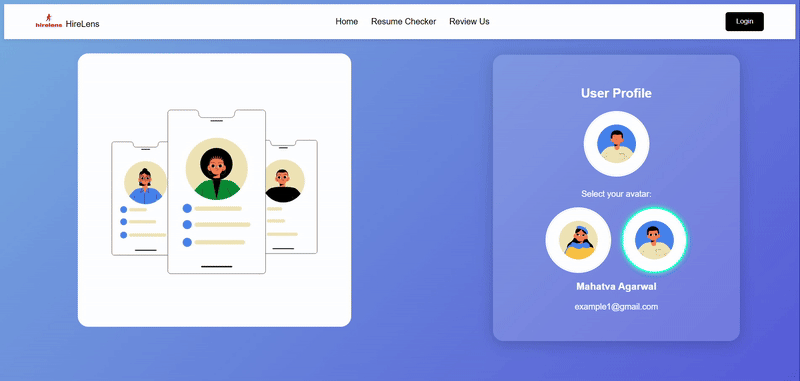

# HireLens
An Ai powered resume checker HireLens helps resume improving there ats score by providing ats scores and usefull ai powered suggestion for improving its ats score also provide ats score and tips for company specific

# 🚀 HireLens – AI Powered Resume Checker

HireLens is an **AI-based Resume Analysis Platform** designed to help job seekers improve their resumes and increase their chances of passing **Applicant Tracking Systems (ATS)** used by companies.

The platform analyzes resumes, provides an **ATS compatibility score**, and offers **AI-powered suggestions** to enhance resume quality, relevance, and structure.

---

## 🌟 Features

### ✅ AI Resume Checker
- Upload your resume and get an **ATS score**
- Detects formatting, keyword gaps, and structure issues
- AI-generated suggestions to improve resume quality

### 🧠 AI-Based Suggestions
- Skill and keyword optimization
- Content improvement tips
- Role-specific recommendations

### 📄 Website Pages
HireLens currently includes **4 main pages**:
1. **Home** – Overview of HireLens and its features  
2. **Resume Checker** – Upload and analyze resumes using AI  
3. **Review Us** – User feedback and testimonials  
4. **Login** – Secure authentication for users  

---
## 📸 Screenshot

  
   
  <em>Login Page</em>

---
## 🛠️ Tech Stack

### Frontend
- HTML  
- CSS  
- JavaScript  
- Modern UI components for clean and responsive design  

### Backend
- Server-side logic for resume processing
- AI integration for resume analysis and scoring
- Secure authentication handling

*(Backend and Frontend are fully separated for scalability and maintainability.)*

---

## 🔮 Future Updates (Coming Soon)

- 🏢 **Company-Based Resume Checker**  
  - Resume analysis tailored to specific companies (Google, Microsoft, startups, etc.)

- 📊 **Advanced ATS Scoring System**  
  - Multiple ATS models simulation
  - Detailed section-wise ATS breakdown

- 🤖 **Role-Based Resume Suggestions**
  - Resume optimization for specific job roles (SDE, Data Analyst, Frontend Developer, etc.)

- 📈 **Resume History & Progress Tracking**
  - Track improvements over time

---

## 🎯 Project Goal

HireLens aims to bridge the gap between **job seekers and ATS systems** by providing:
- Clear insights into resume quality  
- Actionable AI-driven improvements  
- Higher chances of shortlisting  

---

## 📌 Disclaimer

HireLens provides AI-based analysis and suggestions.  
Final hiring decisions depend on recruiters and company-specific ATS systems.

---

## ⭐ Show Your Support

If you like this project, don’t forget to **star ⭐ the repository**!

---

### 🔗 Project Name: **HireLens**
*See your resume the way recruiters do.*
