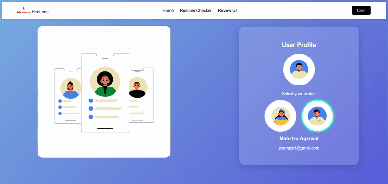

# HireLens-AI-Powered Resume Analyzer & Job Matching Platform 
HireLens is an intelligent web application designed to help users improve their resumes and analyze job compatibility using AI-powered insights and a custom-built ATS (Applicant Tracking System).

Users can upload their resumes in PDF format, receive ATS scores, strengths, improvement suggestions, AI-generated summaries, and job matching analysis based on company and role requirements.



---

## 📋 Table of Contents

- [About](#about)
- [Features](#features)
- [Tech Stack](#tech-stack)
- [Pages](#pages)
- [How It Works](#how-it-works)
- [Getting Started](#getting-started)
- [Environment Variables](#environment-variables)

---


## ✨ Features

-  **ATS Resume Scoring** — Our own built-in ATS engine analyzes your resume and gives an ATS score
-  **Strengths & Improvements** — Get detailed feedback on what's working and what to fix
-  **AI Summary** — Groq API generates a professional summary of your resume on demand
-  **Keyword Matching** — Matches the keyword from resume and display them 
-  **Job Matching** — Enter a company and job role to get a match result (e.g. Strong Match) with a summary
-  **Authentication** — Secure login and signup via Firebase Authentication
-  **User Profile** — Personal profile page for every user
-  **Review Us** — Users can leave feedback and reviews

---

## 📸 Screenshot
<p align="center">
  
  <br>
  <em> Home Page</em>
</p>

---

## 🛠️ Tech Stack

| Layer | Technology |
|---|---|
| **Frontend** | HTML, CSS, JavaScript |
| **Backend** | Node.js, Express.js |
| **Authentication** | Firebase Authentication |
| **Database** | MongoDB |
| **AI API** | Groq API |
| **Resume Parsing** | PDF Processing |
| **Deployment** | Render |

---

## 📄 Pages

| Page | Description |
|---|---|
| **Home** | Landing page introducing HireLens |
| **Login** | Firebase-powered user authentication |
| **Profile** | View and manage your account |
| **Resume Checker** | Upload resume PDF, get ATS score, strengths & improvements |
| **Review Us** | Leave a review or read what others say (Database-MongoDB) |

---


## ⚙️ How It Works

### Resume Checker
1. User uploads their resume in **PDF format**
2. Our custom ATS engine parses and scores the resume
3. Results show:
   -  ATS Score
   -  Strengths
   -  Areas of Improvement
4. Click **AI Summary** → Groq API generates a professional resume summary
5. Click **Job Matching** → Enter company name & job role → Get match result (e.g. *Strong Match*) with a detailed summary

---

## 🎯 Project Goal

HireLens aims to bridge the gap between **job seekers and ATS systems** by providing:
- Clear insights into resume quality  
- Actionable AI-driven improvements  
- Higher chances of shortlisting  

---


## 🚀 Getting Started

````bash
# Clone the repository
git clone https://github.com/your-username/hirelens.git

# Navigate into the project
cd hirelens

# Install dependencies
npm install

# Start the server
npm start
````

---

## 🔑 Environment Variables

Create a `.env` file in the root directory and add the following:

````env
GROQ_API_KEY=your_groq_api_key
MONGODB_URI=your_mongodb_connection_string
FIREBASE_API_KEY=your_firebase_api_key
````

---

## 📌 Disclaimer

HireLens provides AI-based analysis and suggestions.  
Final hiring decisions depend on recruiters and company-specific ATS systems.

---

## ⭐ Show Your Support

If you like this project, don’t forget to **star ⭐ the repository**!

---

### 🔗 Project Name: **HireLens**
*See your resume the way recruiters do.*

---

### 👨‍💻 Developed By
- Mahatva Agarwal
- HireLens Project – AI Resume Analyzer & Job Matcher
